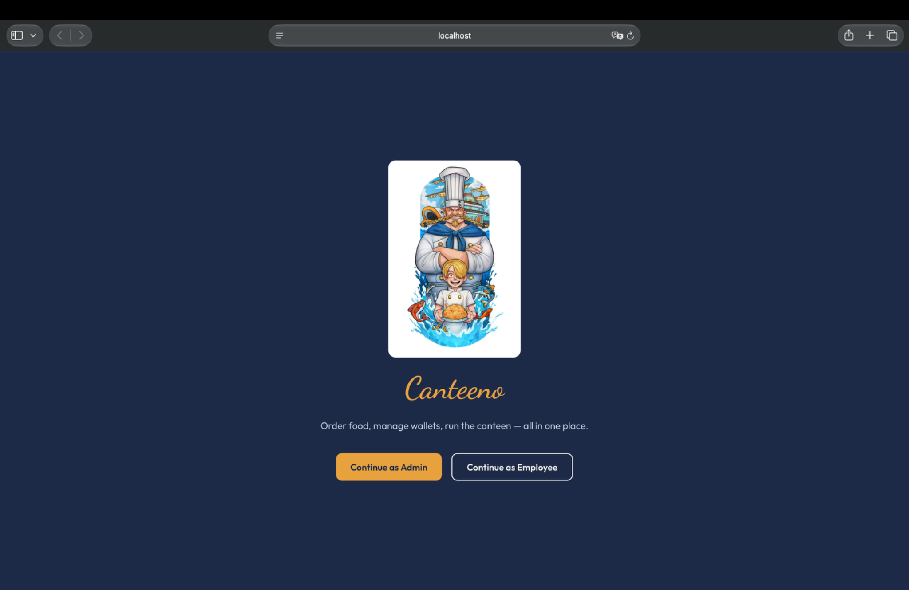
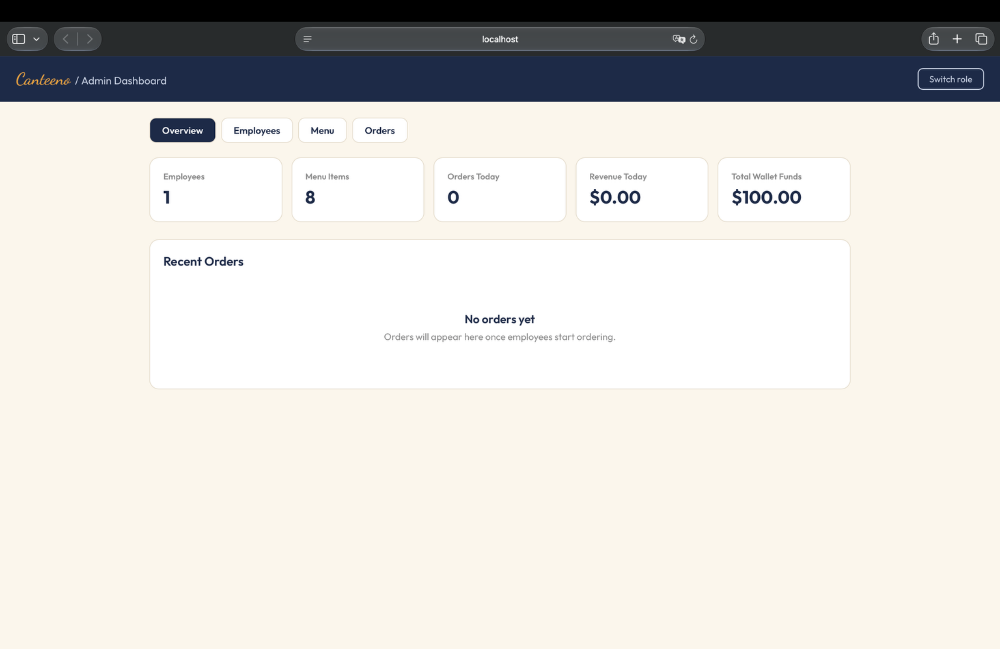
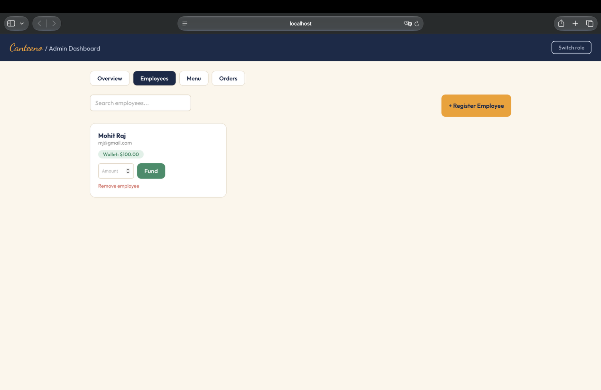
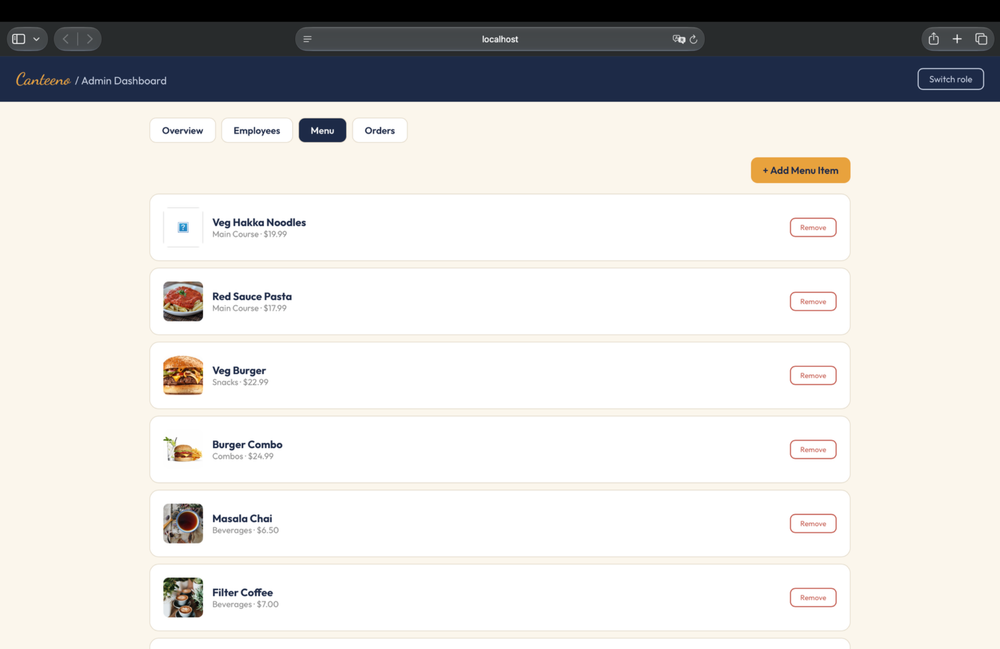
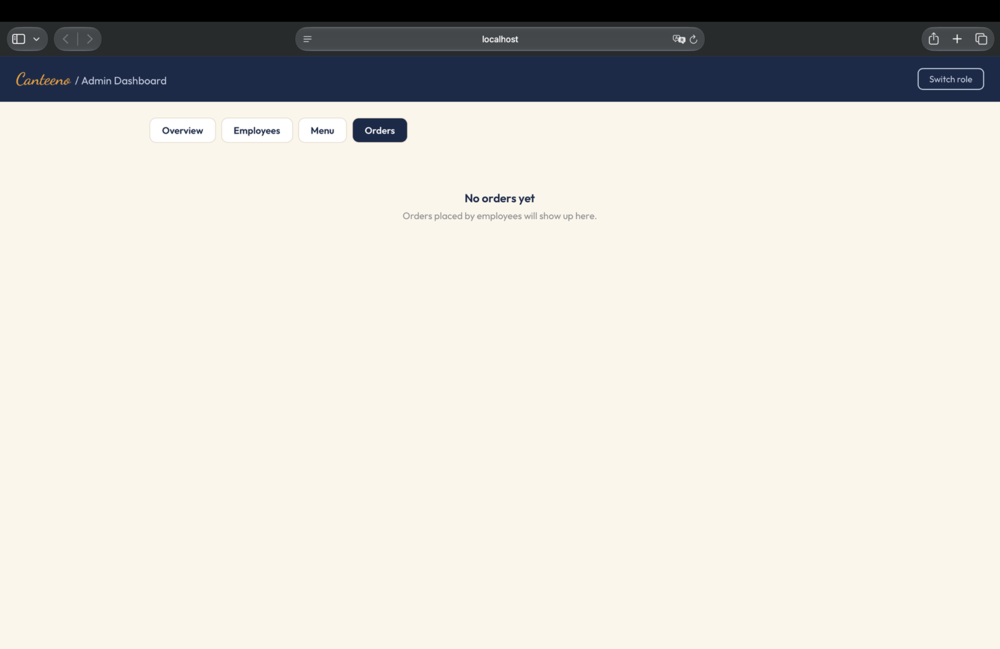
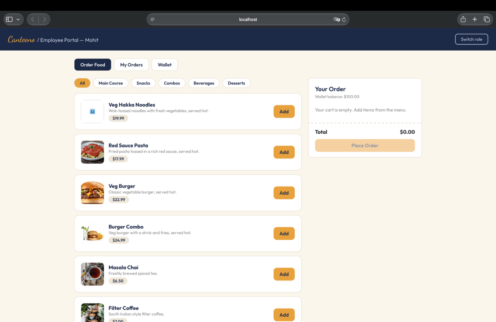
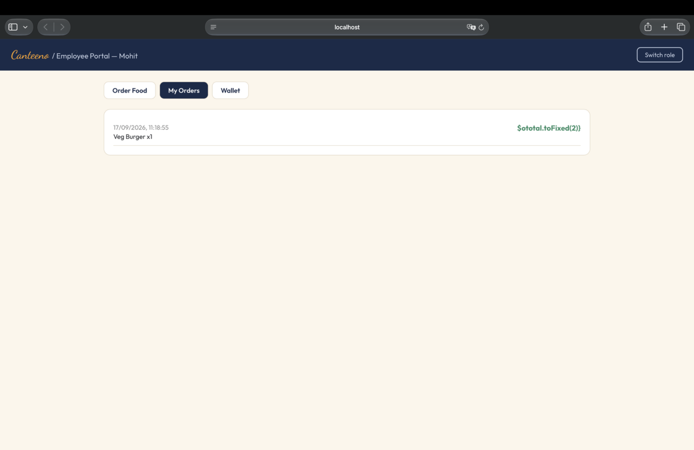
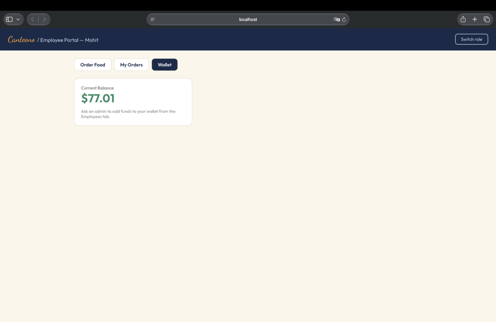

# Canteeno — Canteen Management System (v2)

A complete rewrite of the original Canteen Management System, built fresh rather than reconstructed, with a real ordering system and a refreshed design.

## Screenshots

<table>
<tr>
<td width="50%"><br/><sub><b>Role selection</b></sub></td>
<td width="50%"><br/><sub><b>Admin — overview</b></sub></td>
</tr>
<tr>
<td width="50%"><br/><sub><b>Admin — employees</b></sub></td>
<td width="50%"><br/><sub><b>Admin — menu management</b></sub></td>
</tr>
<tr>
<td width="50%"><br/><sub><b>Admin — orders</b></sub></td>
<td width="50%"><br/><sub><b>Employee — order food</b></sub></td>
</tr>
<tr>
<td width="50%"><br/><sub><b>Employee — my orders</b></sub></td>
<td width="50%"><br/><sub><b>Employee — wallet</b></sub></td>
</tr>
</table>

## What's new vs. the original

The original app let employees browse a menu and have their wallet funded — but there was no way to actually **order food**, which is the core purpose of a canteen system. This version completes that loop:

- **Real ordering system** — employees add items to a cart (styled as a receipt), place an order, and the total is deducted from their wallet automatically, with a clear error if their balance is too low
- **Order history** — both employees (their own orders) and admins (all orders) can see what's been ordered and when
- **Admin menu management** — admins can add/remove menu items instead of the menu being hardcoded, with categories (Main Course, Snacks, Combos, Beverages, Desserts)
- **Admin dashboard overview** — live stats: employee count, menu size, today's orders, today's revenue, total wallet funds
- **Employee selection** — since orders need to be tied to a specific person, employees pick their name after choosing the Employee role (the original had no way to identify which employee was using the app)
- **Fresh visual design** — a distinct spice/canteen-inspired palette (navy, saffron, cream) instead of default Bootstrap styling, "Outfit" for UI text with "Dancing Script" reserved for the Canteeno wordmark, and the cart styled as an actual receipt (dashed tear edge) rather than a generic sidebar

## What's kept from the original

- The "Canteeno" branding and chef illustration
- The core menu items (Noodles, Pasta, Burger, Burger Combo) and their original images
- The Admin / Employee role split concept
- localStorage-based persistence (no backend required)

## Tech stack

React (Create React App), plain CSS with custom properties (no CSS framework dependency this time — fully custom styled), Google Fonts (Outfit, Dancing Script), browser localStorage.

## Project structure

```
src/
├── App.jsx                  # Role routing
├── data/
│   ├── seedMenu.js           # Initial menu items + categories
│   └── store.js              # All localStorage logic (employees, menu, orders, wallet math)
└── components/
    ├── Landing.jsx            # Role selection screen
    ├── AdminPortal.jsx        # Admin dashboard: Overview, Employees, Menu, Orders tabs
    ├── EmployeePortal.jsx     # Employee dashboard: Order Food, My Orders, Wallet tabs
    └── UI.jsx                 # Shared Button, Card, Input, Select, Badge, EmptyState
```

## Running it locally

Needs Node.js/npm installed (`node -v` to check).

```bash
npm install
npm start
```

Opens at `http://localhost:3000`. If the port's already taken, stop whatever's using it and re-run `npm start` — it won't pick a new port automatically.

## Verified working

Tested end-to-end covering the full flow: landing → admin login → register employee → fund wallet ($100) → switch to employee → select employee → browse menu → add item to cart → place order → wallet correctly deducted ($100.00 → $80.01 for a $19.99 item) → order appears in history. Zero console errors throughout.

## Ideas for further improvement

- Order status (pending/preparing/ready) instead of instant completion
- Admin ability to edit existing menu items, not just add/remove
- Export order history as CSV
- Low-wallet-balance warning before checkout

## About me

Mohit Raj, MCA graduate from RV College of Engineering.
[GitHub](https://github.com/mohitrajjj) · [LinkedIn](https://linkedin.com/in/mohit-rajj) · [LeetCode](https://leetcode.com/u/vduZBjuexI/)
